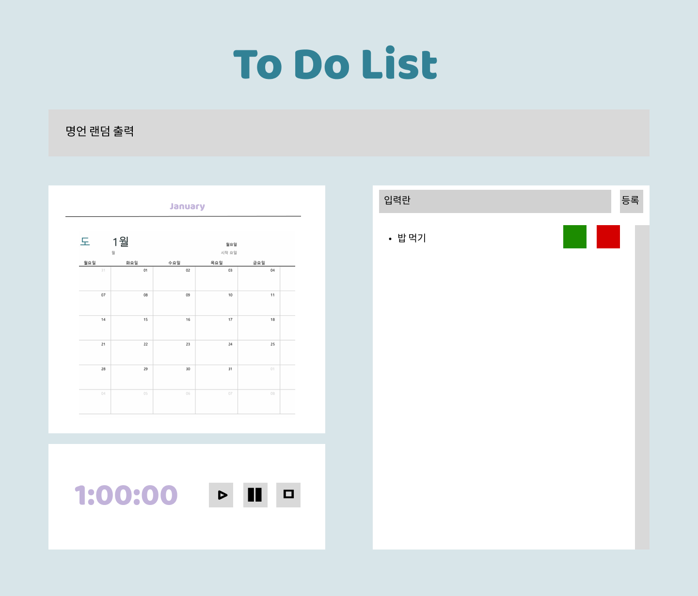

<h1> 투두 프로그램 </h1>

<ul>
<li> 일반적인 투두 리스트 프로그램에 명언 출력, 달력, 스톱워치 기능을 추가한 간단한 프로젝트입니다. 
<li> 투두리스트 작성 뿐만 아니라, 각각의 목표에 할애한 시간을 재고자 스톱워치 기능을 추가하였습니다.
<li> 사용된 언어는 HTML, CSS, Javascript 등입니다.
</ul>

<h4>디자인 계획</h4>

